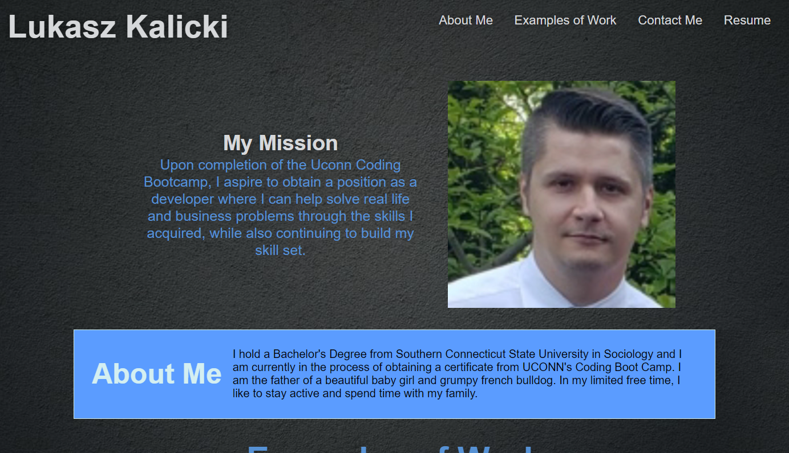

#Professional Portfolio Challenge

Description

Per acceptance criteria and mockup, the requested functionality has been coded on Lukasz's Professional Portfolio page. Creation of this page will allow for a dynamic, editable platform that can be leveraged for future employment, to showcase completed work. A mission statement and 'About Me' section allows for a little personal touch so prospective employers can get to know the aspiring developer more closely. The 'Examples of Work' section link to websites created by the developer, as well as shells for future work to be added. The 'Contact Me' section offers multiple ways to get in touch with the developer as well as links to professional websites. The page has meta data elements added to be mobile-friendly. Links within the page are programmed to open in new windows so the viewer never has to click back to the Portfolio.The navigation bar at the top of the page is designed to be interactive with references to allow for easier navigation, as well as improved styling for visually appealing presentation. The codebase follows accessibility standards, optimizing it for search engines. 

Screenshot

 

Links
<ul>
    <li>
    Deployed application: https://lkalicki.github.io/professional-portfolio/
    </li>
    <li>
    GitHub Repository: https://github.com/lkalicki/professional-portfolio
    </li>
</ul>